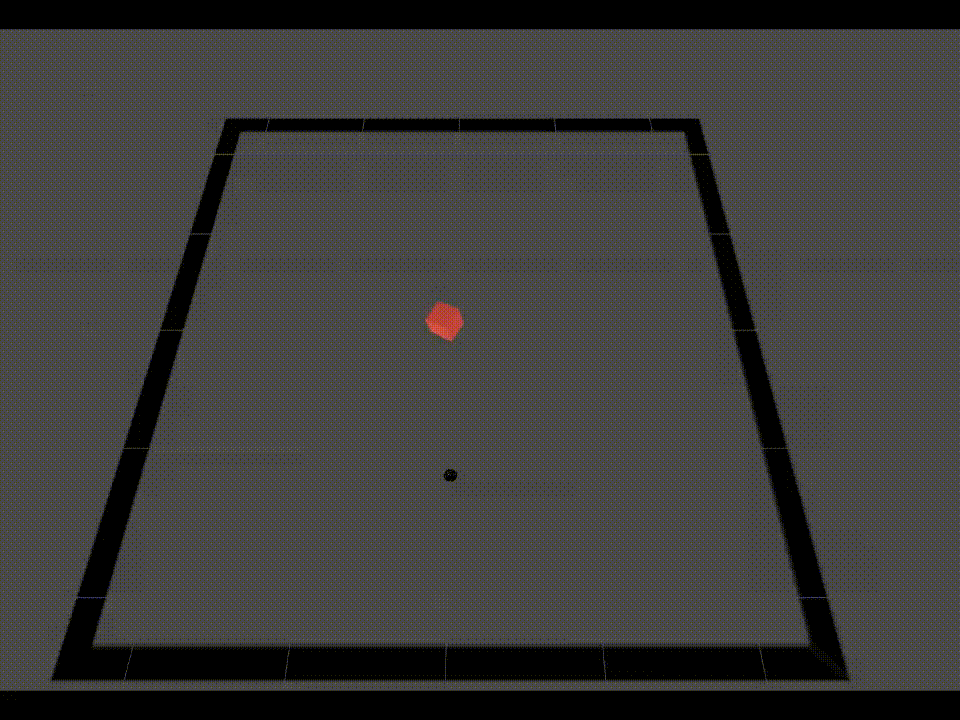
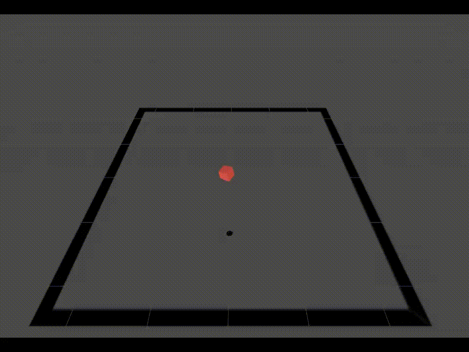
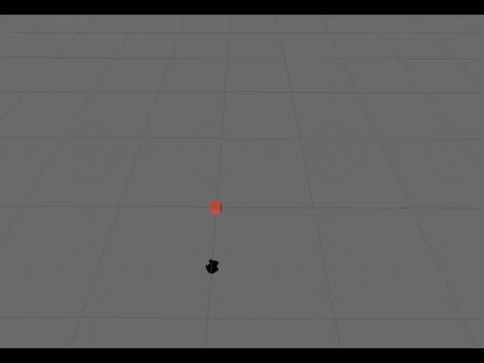
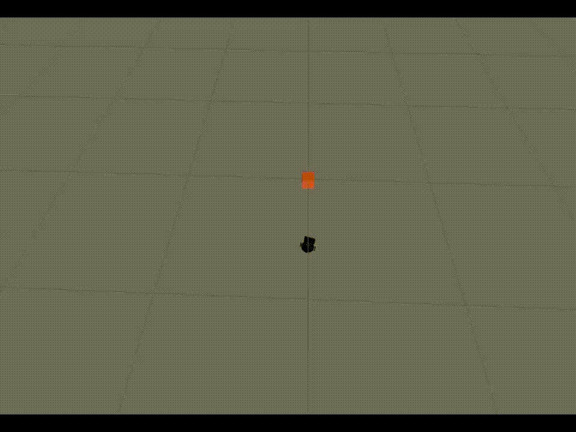

> ## About 

This is repository providing Soft-Actor-Critic (SAC) baseline with 3 experiments namely Line Following, Robot Pursuit and Pushing Object based on [regelum-control](https://regelum.aidynamic.group), a framework for control and reinforcement learning.
It showcases our implementation and experimental results using SAC.

> ## Table of Content
- [Getting started](#getting-started)
- [Monitor training progress and Pick checkpoints](#monitor-training-progress-and-pick-checkpoints)
- [Evaluation with checkpoints](#evaluation-with-checkpoints)
  - [Line Following](#line-following)
  - [Robot Pursuit](#robot-pursuit)
  - [Pushing Object](#pushing-object)
- [Reproduction](#reproduction)
  - [Perform learning process in Gazebo](#perform-learning-process-in-gazebo)
  - [Line Following](#line-following-1)
  - [Robot Pursuit](#robot-pursuit-1)
  - [Pushing Object](#pushing-object-1)


## Getting started
This repository aims to perform all the tasks in a Docker container. Details of running and attaching the Docker container can be found [here](installation.md).

**ALL THE FOLLOWING COMMANDS HAVE TO BE USED INSIDE DOCKER CONTAINTER.**

## Monitor training progress and Pick checkpoints

We utilize the advantage of the MLFlow interface to monitor the performance of each controller and select the best checkpoint over iteration or hyperparameters.

Open a new terminal, get into the Docker container, and execute these commands:
``` bash
# get into a docker container
source docker/into_docker.sh

# navigate to the mlflow directory and run MLFlow UI
cd regelum-playground/regelum_data
mlflow ui
```

The output on your terminal would be like:

```
[DATETIME] [PID] [INFO] Starting gunicorn 20.1.0
[DATETIME] [PID] [INFO] Listening at: http://127.0.0.1:5000 (73632)
[DATETIME] [PID] [INFO] Using worker: sync
```

Click on the URL `http://127.0.0.1:5000` and then MLFlow interface will pop-up in your browser.

Torch model dictionary of states are store in a folder under this format:
```
/regelum-playground/regelum_data/outputs/<DATE>/<TIME>/0/.checkpoints
```

## Evaluation with checkpoints
We already created some scripts to simplify steps in evaluation phase according to experiments and their buffer size:

```bash
source scripts/sac_eval/run_lf_sim_large.sh
source scripts/sac_eval/run_lf_sim_small.sh
source scripts/sac_eval/run_po_sim_large.sh
source scripts/sac_eval/run_po_sim_small.sh
source scripts/sac_eval/run_rp_sim_large.sh
source scripts/sac_eval/run_rp_sim_small.sh
```

To use your own checkpoints, please modify the parameter `scenario.checkpoint_dirpath` in your chosen script.

Eventually, we will have results which are illustrated by these video.

### Line Following

<div align="center">
    <h2>Large buffer on the left side - Small buffer on the right side</h2>
    
    
</div>

### Robot Pursuit

<div align="center">
    <h2>Large buffer on the left side - Small buffer on the right side</h2>
    
    
</div>

### Pushing Object

<div align="center">
    <h2>Large buffer on the left side - Small buffer on the right side</h2>
    
    
</div>


## Reproduction
In this baseline, we only provide experiments with Sort-Critic-Actor (SAC).

### Perform learning process in Gazebo

Open a Terminal to navigate to the workspace folder inside the Docker container.

``` bash
# run a container
source docker/run_docker.sh

# inside the container
cd regelum-playground
```

### Line Following
Execute pre-defined environmnent setups and controllers by using the following command:

``` bash
source scripts/sac/run_lf_sim.sh
```

### Robot Pursuit
Execute pre-defined environmnent setups and controllers by using the following command:

``` bash
source scripts/sac/run_rp_sim.sh
```

### Pushing Object
Execute pre-defined environmnent setups and controllers by using the following command:

``` bash
source scripts/sac/run_po_sim.sh
```